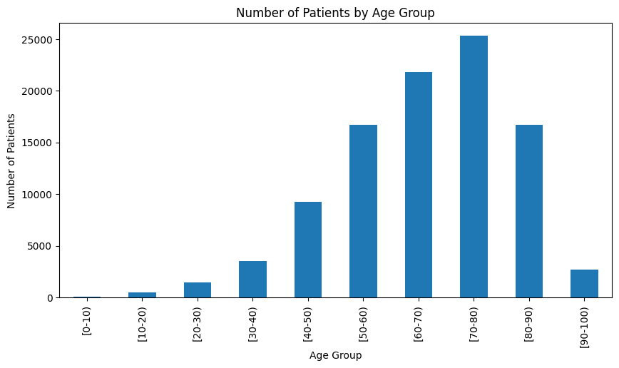
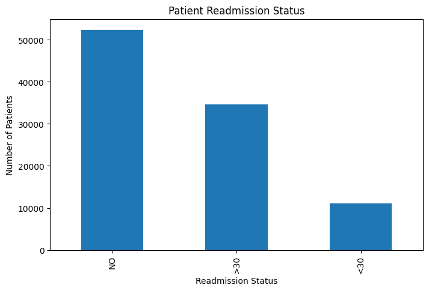
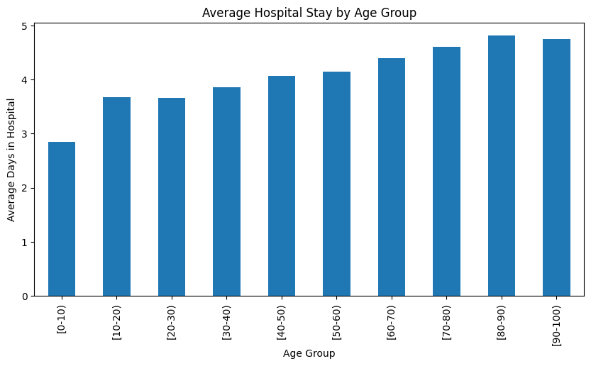

# Diabetes 130-US Hospitals: Data Cleaning Project

Cleaning and preparing a real-world healthcare dataset (101,766 patient records from 130 US hospitals, 1999–2008) for analysis, with a focus on handling missing values, inconsistent data patterns, and data validation.

## Data Source

- **Dataset:** [Diabetes 130-US Hospitals for Years 1999-2008](https://archive.ics.uci.edu/dataset/296/diabetes+130-us+hospitals+for+years+1999-2008)
- **Provider:** UCI Machine Learning Repository
- **Original size:** 101,766 rows × 48 columns
- **License:** CC BY 4.0

## Cleaning Process

### 1. Missing Value Detection

Checked for missing values using multiple methods, since missingness wasn't always represented as standard `NaN`:
- Standard `NaN` values (`df.isnull().sum()`)
- Hidden placeholder values discovered by inspecting unique values per column (e.g. `Unknown/Invalid`, `PhysicianNotFound`)

### 2. Column-Level Decisions

| Column | Missing % | Action | Reason |
|---|---|---|---|
| `weight` | 96.9% | Dropped | Too sparse to be reliable |
| `payer_code` | 39.6% | Dropped | Not relevant to clinical analysis |
| `max_glu_serum` | 94.7% | Filled with `"Not Tested"` | Missingness reflects a real clinical decision (test not ordered), not missing data |
| `A1Cresult` | 83.3% | Filled with `"Not Tested"` | Same reasoning as above |
| `medical_specialty` | 49.1% | Filled with `"Unknown"` | Too valuable to drop entirely; kept as its own category |
| `race` | 2.2% | Rows dropped | Low missing rate; safe to remove affected rows |
| `diag_1`, `diag_2`, `diag_3` | <1.4% | Rows dropped | Low missing rate |
| `gender` | 3 rows (`Unknown/Invalid`) | Rows dropped | Not a usable category for analysis |

### 3. Duplicate Check

Verified with `df.duplicated().sum()` — no duplicate rows found.

### 4. Outlier Check

Reviewed summary statistics (`df.describe()`) for all numeric columns. No implausible values (e.g. negative numbers, impossible ranges) were found.

## Results

| Metric | Before | After |
|---|---|---|
| Rows | 101,766 | 98,052 |
| Columns | 48 | 46 |
| Missing values | Present across 8+ columns | 0 |
| Duplicate rows | 0 | 0 |

**Data retained:** ~96.3% of original rows

## Key Findings

After cleaning, a short exploratory analysis was performed to validate the dataset and surface initial patterns:

**Age distribution:** Patients are concentrated in older age groups, peaking at 70–80 years — consistent with the higher prevalence of type 2 diabetes in older populations.

**Readmission status:** The majority of patients (~53%) were not readmitted. About 11% were readmitted within 30 days — the group most relevant for readmission-risk analysis.

**Age vs. length of stay:** Average hospital stay increases with age, from ~2.8 days for patients under 10 to ~4.8 days for patients in their 80s, suggesting older patients tend to have more complex or longer treatment needs.

## Tools Used

- Python 3.10
- pandas
- Jupyter Notebook (VS Code)
- Dataset accessed via `ucimlrepo`
